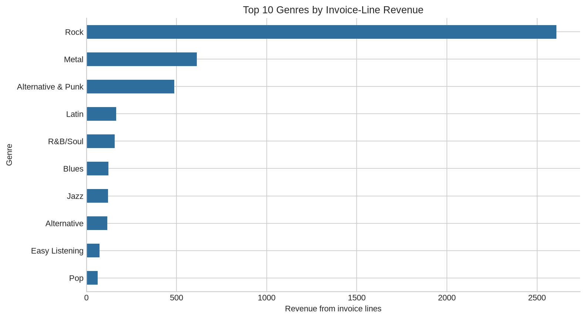

# Music Store Analysis — Advanced SQL Case Study

An end-to-end SQL analysis of a Chinook-style relational music store database. The project answers business questions across customer spending, invoices, artists, genres, tracks, and employee-supported sales using joins, subqueries, common table expressions, aggregations, and window functions.

> **Portfolio focus:** relational thinking, business-question decomposition, SQL readability, revenue analysis, and translating normalized tables into stakeholder insights.

## Business objective

A music retailer needs to understand where revenue comes from, which genres and artists drive purchases, which countries contribute the most sales, and how customer and invoice activity can be compared fairly. The queries in this repository turn those questions into reproducible SQL analyses.

## Verified dataset facts

The repository includes **614 invoices**, **4,757 invoice lines**, **3,503 tracks**, **275 artists**, **25 genres**, and **59 customers** [1]–[6]. Invoice totals sum to **$4,709.43** in the included extract [1].

| Metric | Verified result |
|---|---:|
| Invoices | 614 |
| Invoice lines | 4,757 |
| Tracks | 3,503 |
| Artists | 275 |
| Genres | 25 |
| Customers | 59 |
| Invoice total | $4,709.43 |
| Highest invoice-revenue country | USA |
| Highest invoice-line-revenue genre | Rock ($2,608.65) |

## Visual evidence



The chart is generated from `data/invoice_line.csv`, `data/track.csv`, and `data/genre.csv`. It shows invoice-line revenue by genre and is intended as a compact visual companion to the SQL results.

## Key business insights

The USA is the leading country by invoice revenue in the supplied extract, and Rock is the leading genre by invoice-line revenue at **$2,608.65**. These descriptive results can help a retailer prioritize deeper analysis of customer cohorts, artist concentration, and repeat purchase behavior.

The project distinguishes invoice-level revenue from invoice-line revenue. That distinction matters because invoice totals describe billed transactions, while invoice-line calculations support product, genre, and track-level analysis. Reviewers should avoid adding both measures together because they represent different grains.

## SQL techniques demonstrated

The query set includes multi-table joins, correlated and scalar subqueries, CTEs, window functions, ranking, conditional aggregation, date filtering, and revenue calculations. `queries.sql` groups the analysis into business questions rather than presenting disconnected syntax examples.

## Data-quality checks

The included CSV extracts have no duplicate rows in the primary tables used for analysis. The customer, employee, and track files contain some optional missing values [7]–[9], which is expected for fields such as company, fax, composer, or other non-key attributes. The analysis should validate primary-key uniqueness and referential integrity before loading the files into MySQL.

## Repository structure

```text
├── data/
│   ├── album.csv
│   ├── artist.csv
│   ├── customer.csv
│   ├── employee.csv
│   ├── genre.csv
│   ├── invoice.csv
│   ├── invoice_line.csv
│   ├── media_type.csv
│   ├── playlist.csv
│   ├── playlist_track.csv
│   └── track.csv
├── images/
│   └── genre_revenue.png
├── queries.sql
├── questions.pdf
└── schema_diagram.png
```

## How to run

1. Install MySQL 8 or another compatible SQL engine.
2. Import the CSV files from `data/` while preserving the key relationships shown in `schema_diagram.png`.
3. Run `queries.sql` in sections and verify the result grain before combining outputs.
4. Regenerate the chart with the local Python environment if the source data changes:

```bash
python -m pip install pandas matplotlib
python generate_music_chart.py
```

## Data provenance and limitations

The repository contains the educational CSV extracts used for this case study and a schema diagram for the relational structure. It is a Chinook-style practice dataset, not a live commercial music-store database. The revenue findings are therefore useful for demonstrating SQL analysis but should not be interpreted as current market or company performance.

## References

[1]: data/invoice.csv — invoice-level transactions.
[2]: data/invoice_line.csv — invoice-line transactions.
[3]: data/track.csv — track attributes.
[4]: data/artist.csv — artist dimension.
[5]: data/genre.csv — genre dimension.
[6]: data/customer.csv — customer dimension.
[7]: data/employee.csv — employee dimension.
[8]: data/album.csv — album dimension.
[9]: schema_diagram.png — relational structure reference.

## Author

**Mayank Srivastava** · [GitHub](https://github.com/Corvus06655) · [LinkedIn](https://linkedin.com/in/mayank-srivastava-076020215)
